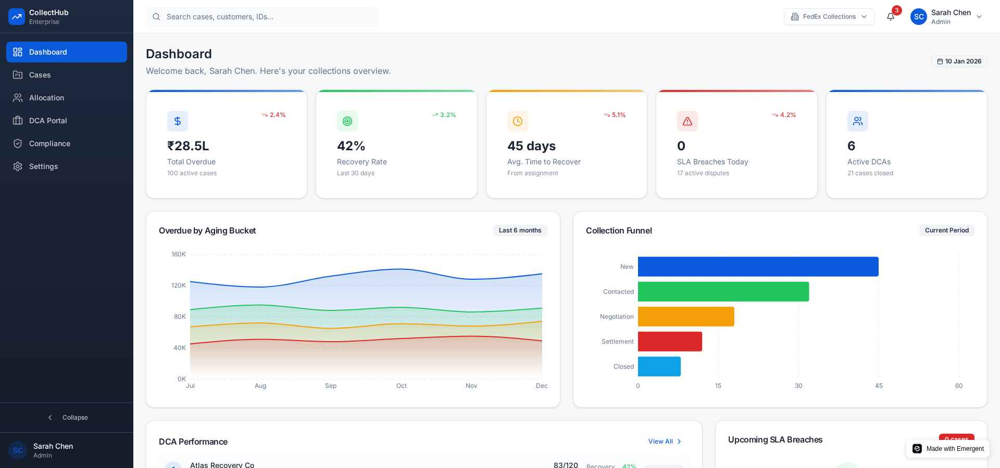
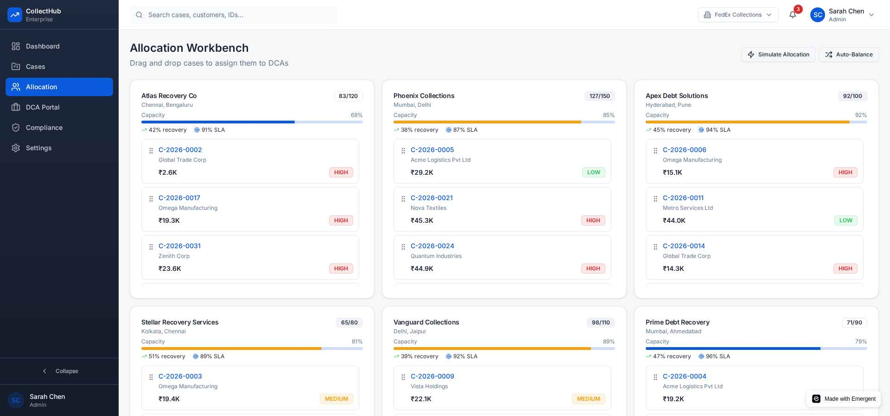
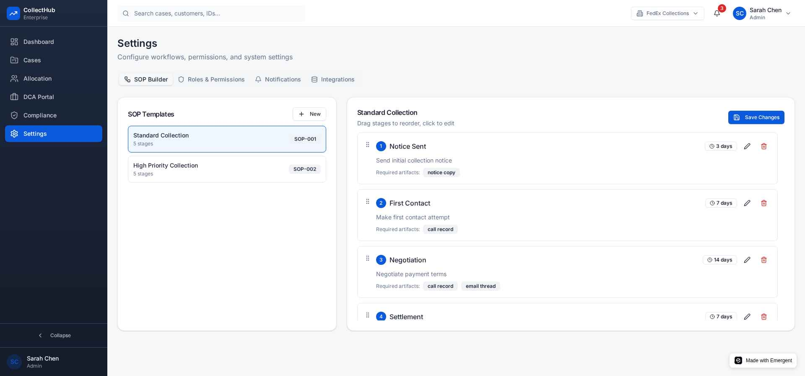

# CollectHub - Enterprise Collections Management Platform

<div align="center">
  
  
  
  
</div>

---

## 📋 Overview

CollectHub is an enterprise-grade, responsive UI prototype that centralizes case allocation, tracks SOP-driven workflows & SLAs, improves recovery accountability, provides real-time dashboards, and enables structured collaboration with external Debt Collection Agencies (DCAs).

> **Note:** This is a **UI prototype** with mock data. No backend integration is included - all data is generated client-side for demonstration purposes.

---

## 📸 Screenshots & Page Descriptions

### 1. Dashboard


The **Dashboard** is the central command center for collections managers and executives. It provides:

| Component | Description |
|-----------|-------------|
| **KPI Cards** | Five key metrics at a glance - Total Overdue (₹28.5L), Recovery Rate (42%), Avg Time to Recover (45 days), SLA Breaches Today, and Active DCAs count |
| **Overdue by Aging Bucket** | Multi-line area chart showing overdue amounts segmented by aging periods (0-30, 31-60, 61-90, 90+ days) over the last 6 months |
| **Collection Funnel** | Horizontal bar chart visualizing the pipeline stages from New → Contacted → Negotiation → Settlement → Closed |
| **DCA Performance** | Leaderboard showing top-performing debt collection agencies with recovery rates and SLA compliance |
| **Upcoming SLA Breaches** | Alert panel highlighting cases approaching their SLA deadlines within 48 hours |

---

### 2. Cases List


The **Cases List** is the primary workspace for managing collection cases. Features include:

| Component | Description |
|-----------|-------------|
| **Data Table** | Sortable columns: Case ID, Customer, Outstanding Amount, Aging Days, Priority, Assigned DCA, Stage, SLA Status, Last Activity |
| **Advanced Filters** | Six dropdown filters - Aging bucket, Region, DCA, Priority, Stage, SLA Status |
| **Search Bar** | Quick search by case ID or customer name |
| **View Toggle** | Switch between table view and card view layouts |
| **Bulk Selection** | Checkbox selection for bulk operations (assign, tag, export) |
| **Row Actions** | Quick access to view details, reassign, or add notes |
| **Pagination** | Navigate through 100 cases with 15 items per page |
| **Priority Badges** | Color-coded labels (HIGH=red, MEDIUM=yellow, LOW=green) |
| **SLA Countdown** | Visual indicators showing time remaining before SLA breach |

---

### 3. Case Detail


The **Case Detail** page provides comprehensive information about a single collection case:

| Component | Description |
|-----------|-------------|
| **Case Header** | Case ID (C-2026-0001), Priority badge, Customer name, SLA countdown timer |
| **Summary Cards** | Outstanding amount (₹19,695), Expected Recovery (₹13,545), Aging (100 days), Recovery Probability (90%) |
| **Tab Navigation** | Overview, Activity Timeline, Documents, Audit Log |
| **Customer Information** | Company name, Customer ID, Region, Assigned DCA |
| **SOP Progress** | Visual stepper showing workflow completion (4/5 stages complete) with timestamps |
| **Actions Panel** | Quick actions - Log Call, Upload Evidence, Propose Settlement, Mark Promise-to-Pay, Escalate to Legal |
| **Current Stage** | Dropdown to change case stage with real-time updates |
| **Assigned DCA** | DCA details with option to reassign |

---

### 4. Allocation Workbench


The **Allocation Workbench** enables drag-and-drop case distribution across DCAs:

| Component | Description |
|-----------|-------------|
| **DCA Lanes** | Six kanban-style columns, one for each DCA (Atlas Recovery, Phoenix Collections, Apex Debt Solutions, etc.) |
| **Capacity Bars** | Visual progress bars showing current load vs. max capacity (e.g., 83/120, 127/150) |
| **Performance Metrics** | Recovery rate and SLA compliance percentage for each DCA |
| **Draggable Cards** | Case cards with grip handle, Case ID, customer name, amount, and priority badge |
| **Simulate Allocation** | AI-powered button to suggest optimal case distribution based on DCA performance |
| **Auto-Balance** | One-click redistribution to balance workloads across DCAs |
| **Allocation History** | Recent assignment log showing case movements with timestamps |

---

### 5. DCA Portal


The **DCA Portal** is a simplified view for debt collection agency partners:

| Component | Description |
|-----------|-------------|
| **Agency Header** | DCA name (Atlas Recovery Co) with "Message Enterprise" button |
| **KPI Dashboard** | Four metrics - Active Cases (11), Urgent (0), Recovery Rate (42%), SLA Compliance (91%) |
| **Assigned Cases** | Prioritized inbox sorted by SLA urgency with search and filter options |
| **Case Cards** | Priority strip, case ID, customer, region, outstanding amount, stage badge, SLA countdown |
| **Quick Actions** | Phone and email icons for immediate contact |
| **Recovery Performance** | Line chart showing weekly recovered amounts vs. targets |
| **Cases by Stage** | Donut chart breaking down cases by workflow stage |
| **Bulk Actions** | Upload evidence, download reports, schedule follow-ups |

---

### 6. Compliance & Audit


The **Compliance & Audit** page provides oversight and regulatory tracking:

| Component | Description |
|-----------|-------------|
| **Summary Cards** | Open Issues (3), Critical/High Priority (2), Audit Entries (10), Compliance Rate (94%) |
| **Tab Navigation** | Audit Log, Compliance Issues (with badge count), Reports |
| **Audit Trail Table** | Timestamp, Action Type, Actor, Target Case/User, Details, View button |
| **Action Badges** | Color-coded labels - Case Assigned, Stage Updated, Evidence Uploaded, Payment Recorded, SLA Extended, Role Changed |
| **Filters** | Search by case/actor, Action Type dropdown, Date Range selector |
| **Compliance Issues** | List of violations with severity levels (Critical, High, Medium, Low) |
| **Export Report** | Download compliance data for external audits |

---

### 7. Settings


The **Settings** page allows administrators to configure system workflows:

| Component | Description |
|-----------|-------------|
| **Tab Navigation** | SOP Builder, Roles & Permissions, Notifications, Integrations |
| **SOP Templates** | List of available workflows (Standard Collection, High Priority Collection) |
| **Stage Editor** | Drag-and-drop workflow builder with numbered stages |
| **Stage Configuration** | Stage name, SLA duration (3-14 days), description, required artifacts |
| **Artifact Tags** | Badges showing required evidence (notice copy, call record, email thread) |
| **Stage Actions** | Edit and delete buttons for each stage |
| **Save Changes** | Persist workflow modifications |
| **Add Stage** | Button to append new stages to the workflow |

---

## 👥 User Roles

| Role | Access Level |
|------|--------------|
| **Enterprise Admin** | Full access: dashboards, allocation, SOPs, audit, settings |
| **DCA Agent / Collector** | Assigned cases, activity logging, evidence upload, escalations |
| **Compliance Officer** | Audit trail, compliance flags, review templates |
| **Executive / Ops** | Summary dashboards, trends, scorecards |

Switch between roles using the user menu in the top-right corner.

---

## 🎨 Design System

### Color Palette
| Token | Value | Usage |
|-------|-------|-------|
| Primary | `#0B5FFF` | Brand, CTAs, links |
| Success | `#16A34A` | Positive status, recovery |
| Warning | `#F59E0B` | Caution, SLA warnings |
| Destructive | `#DC2626` | Errors, breaches |
| Background | `#F8FAFC` | Page background |
| Surface | `#FFFFFF` | Cards, modals |

### Typography
- **Font**: Inter (400, 500, 600, 700 weights)
- **Headings**: 24-28px (h1), 20-22px (h2)
- **Body**: 14-16px

---

## 🗂️ Project Structure

```
/app/frontend/src/
├── components/
│   ├── layout/
│   │   ├── Layout.jsx       # Main app shell
│   │   ├── Sidebar.jsx      # Collapsible navigation
│   │   └── TopBar.jsx       # Header with search, notifications
│   └── ui/                  # shadcn/ui components
├── context/
│   └── AppContext.js        # Global state management
├── data/
│   └── mockData.js          # 100 synthetic cases, DCAs, KPIs
├── pages/
│   ├── Dashboard.jsx        # KPIs, charts, leaderboard
│   ├── CasesList.jsx        # Table/card view with filters
│   ├── CaseDetail.jsx       # Case overview, timeline, actions
│   ├── Allocation.jsx       # Drag-drop workbench
│   ├── DCAPortal.jsx        # Partner inbox and dashboard
│   ├── Compliance.jsx       # Audit trail and issues
│   └── Settings.jsx         # SOP builder, permissions
├── App.js                   # Router configuration
└── index.css                # Design tokens, custom styles
```

---

## 🚀 Getting Started

### Prerequisites
- Node.js 18+
- Yarn package manager

### Installation

```bash
# Navigate to frontend directory
cd /app/frontend

# Install dependencies
yarn install

# Start development server
yarn start
```

The app will be available at `http://localhost:3000`

### Available Scripts

| Command | Description |
|---------|-------------|
| `yarn start` | Start development server |
| `yarn build` | Create production build |
| `yarn test` | Run test suite |

---

## 📊 Mock Data

The prototype includes **100 synthetic cases** with realistic attributes:

```json
{
  "case_id": "C-2026-0001",
  "customer": {
    "name": "Acme Logistics Pvt Ltd",
    "customer_id": "CU-00938",
    "region": "Chennai"
  },
  "outstanding_amount": 12450.75,
  "currency": "INR",
  "aging_days": 62,
  "priority": "HIGH",
  "assigned_dca": "Atlas Recovery Co",
  "stage": "Negotiation",
  "expected_recovery": 9800,
  "p_recover": 0.79,
  "sla_deadline": "2026-01-13T11:00:00+05:30",
  "dispute_flag": false,
  "evidence": [...],
  "activities": [...],
  "sop_progress": [...]
}
```

---

## 🛠️ Tech Stack

| Technology | Purpose |
|------------|---------|
| React 19 | UI framework |
| Tailwind CSS 3.4 | Utility-first styling |
| shadcn/ui | Accessible component primitives |
| Recharts 3.6 | Data visualization |
| @dnd-kit | Drag and drop |
| Framer Motion | Animations |
| React Router 7 | Navigation |
| Lucide React | Icons |
| Sonner | Toast notifications |

---

## 📱 Responsive Design

The UI is optimized for:
- **Desktop**: Full dashboard with sidebar navigation (1920px+)
- **Tablet**: Condensed layouts with collapsible sidebar (768px-1919px)
- **Mobile**: Simplified case list and quick actions (<768px)

---

## 🔮 Future Enhancements

- [ ] Backend API integration (FastAPI)
- [ ] MongoDB database connectivity
- [ ] Real authentication (OAuth 2.0)
- [ ] WebSocket for real-time updates
- [ ] PDF report generation
- [ ] Email/SMS notification integration
- [ ] Advanced analytics with AI insights

---

## 📄 License

This project is proprietary and intended for demonstration purposes only.

---

<div align="center">
  <p>Built with ❤️ for enterprise collections management</p>
</div>
