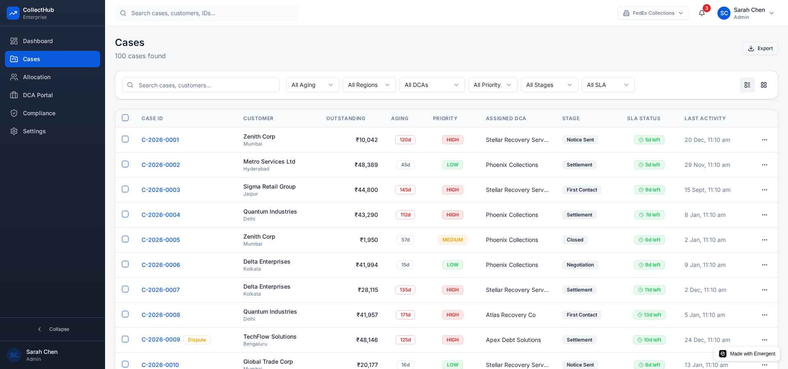
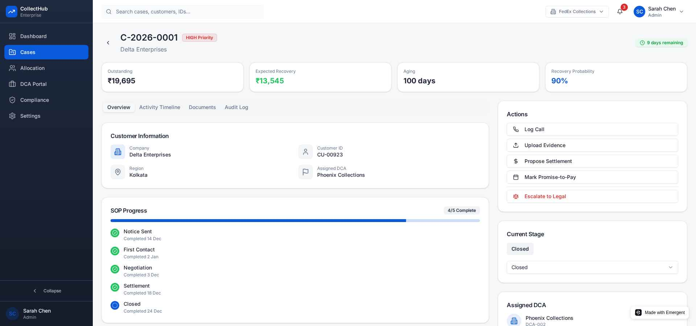
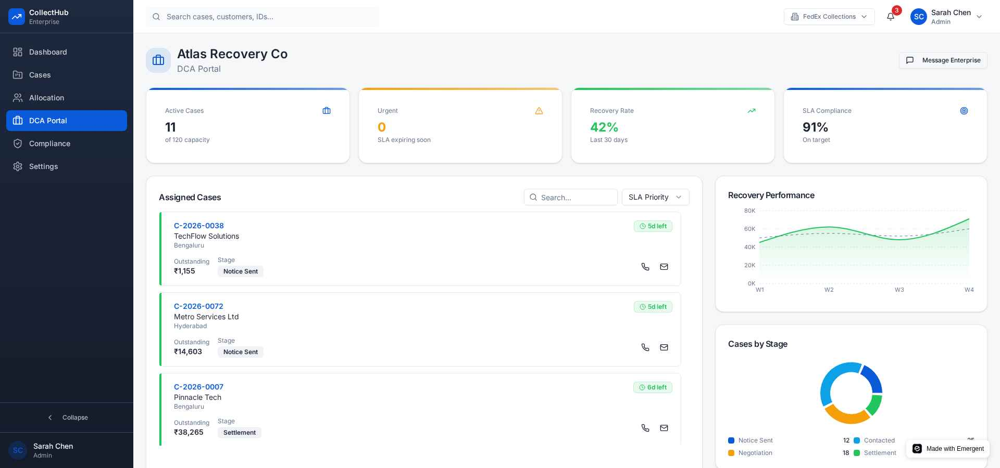
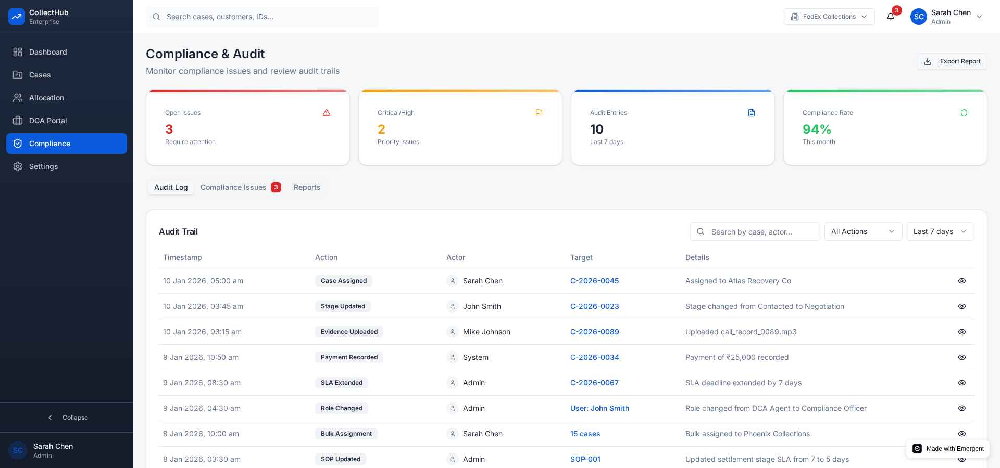

# CollectHub — AI-Native Enterprise DCA Management Platform

<div align="center">
  
  
  
  
  
</div>

---

## 📌 Executive Summary

**CollectHub** is an AI-native, enterprise-ready Debt Collection Agency (DCA) management platform designed to modernize and govern the end-to-end collections lifecycle.

It replaces fragmented Excel- and email-driven operations with:
- centralized case orchestration
- SOP-driven workflows
- SLA enforcement
- AI-based recovery prioritization
- real-time dashboards
- auditable collaboration with external DCAs

> **Current status:** This repository contains a **high-fidelity UI prototype** with realistic mock data and enterprise flows. The design is intentionally backend-ready and ML-ready.

Live Demo:  
👉 https://agent-69623928f1a870cef06b6f89--collection-hu.netlify.app/

---

## 🧠 Core Idea

Traditional DCA management suffers from:
- manual allocation
- delayed feedback
- weak accountability
- no predictive intelligence
- limited auditability

**CollectHub reimagines collections as a controlled, data-driven system** by combining:
1. **AI decisioning** (what to pursue, when, and how)
2. **Workflow automation** (SOP + SLA as enforceable logic)
3. **Optimization-based allocation** (right case → right DCA)
4. **Governance & auditability** (every action traceable)

Think of CollectHub as:
> **“Jira + CRM + SLA Engine + AI Optimizer” for enterprise debt recovery**

---

## 🏗️ High-Level Architecture

> _(Backend & AI ready — UI currently implemented)_

### 📐 Architecture Diagram


**Layers**
- **Presentation Layer**: React + Tailwind + shadcn/ui
- **Workflow Layer**: SOP & SLA orchestration
- **AI Decision Layer**: Recovery scoring, prioritization, allocation
- **Data Layer**: Case, activity, audit, performance metrics
- **Integration Layer**: ERP, billing, legacy systems (RPA-friendly)

---

## 🔄 End-to-End System Flow

### 📊 System Flow Diagram


1. Overdue accounts ingested from billing/ERP
2. AI models score each case
3. Cases prioritized and allocated to DCAs
4. DCAs execute actions via structured portal
5. SLA engine monitors progress
6. Escalations triggered automatically
7. Outcomes feed back into models

---

## 🤖 AI & ML Intelligence (Planned + MVP-ready)

### 📈 ML Pipeline Diagram


### Model 1 — Recovery Probability (Classification)
**Goal:** Predict probability that a case will be recovered within a defined horizon.

- Algorithms: LightGBM / CatBoost
- Output: `P_recover`
- Used for:
  - prioritization
  - expected recovery value
  - allocation optimization

---

### Model 2 — Expected Recovery Amount (Regression)
**Goal:** Estimate how much value is likely to be recovered.

- Proxy (public data): `Outstanding × P_recover`
- Enterprise version:
  - regression on recovered principal
  - confidence intervals

---

### Model 3 — Time-to-Recover (Survival Analysis)
**Goal:** Predict *when* recovery is likely to happen.

- Algorithms:
  - Cox Proportional Hazards
  - Random Survival Forest
- Output:
  - expected days to recovery
  - probability curve over time

---

### Priority Scoring Formula (Example)

```

PriorityScore =
0.55 × P_recover

* 0.25 × log(Outstanding)

- 0.15 × AgingPenalty
- 0.05 × DisputeRisk

```

Buckets:
- HIGH
- MEDIUM
- LOW

---

## 🧮 Allocation Algorithm (Case → Best DCA)

Instead of equal distribution, CollectHub uses **optimization-based assignment**.

**Inputs**
- case recovery score
- DCA historical performance by segment
- capacity limits
- SLA compliance history
- governance rules

**Objective**
```

Maximize Σ ExpectedRecovery(case, dca)

```

**Constraints**
- each case assigned once
- DCA capacity limits
- compliance restrictions

This dramatically improves:
- recovery rate
- predictability
- accountability

---

## 📸 Screenshots & UI Walkthrough

> _(Existing frontend images retained as-is)_

### 1. Dashboard


Central command center with:
- KPIs
- aging trends
- funnel visualization
- DCA leaderboard
- SLA alerts

---

### 2. Cases List


Operational workspace:
- sortable table
- advanced filters
- bulk actions
- SLA countdowns
- priority badges

---

### 3. Case Detail


Single source of truth:
- SOP progress
- activity timeline
- evidence uploads
- escalation controls
- audit trail

---

### 4. Allocation Workbench


AI-assisted allocation:
- drag-drop lanes
- capacity visualization
- simulate AI allocation
- rebalance workloads

---

### 5. DCA Portal


Secure partner collaboration:
- prioritized inbox
- SLA-aware views
- structured action logging
- performance visibility

---

### 6. Compliance & Audit


Governance layer:
- immutable audit logs
- compliance issues
- exportable reports

---

### 7. Settings (SOP Builder)


Workflow-as-code:
- drag-drop SOP stages
- SLA configuration
- required artifacts
- role-based controls

---

## ⚙️ How CollectHub Improves Over Existing Systems

| Existing State | CollectHub |
|----------------|------------|
| Excel & emails | Centralized platform |
| Manual allocation | AI-driven optimization |
| No prioritization | Predictive scoring |
| Weak SLA control | Automated SLA engine |
| Opaque ownership | Full audit trail |
| Reactive recovery | Predictive & proactive |

---

## 📈 Scalability & Enterprise Readiness

- Stateless frontend
- Event-driven backend design
- Horizontal scaling via microservices
- ML models retrainable on internal data
- Feature store & model registry ready
- Supports 10K → 1M+ cases/month

---

## 🔐 Security & Governance (Design-time)

- Role-based access control (RBAC)
- Field-level PII masking
- Immutable audit logs
- Evidence-driven workflows
- Manual override justification

---

## 🛠️ Tech Stack

**Frontend**
- React 19
- Tailwind CSS
- shadcn/ui
- Recharts
- Framer Motion
- @dnd-kit

**Backend (Planned)**
- FastAPI
- PostgreSQL
- Kafka
- Redis
- Temporal / Camunda

**ML (Planned)**
- scikit-learn
- LightGBM / CatBoost
- MLflow
- SHAP (explainability)

---

## 🔮 Future Enhancements

- AI copilot for collectors
- Auto-negotiation suggestions
- Real-time WebSocket updates
- RPA for legacy systems
- Multi-region compliance rules
- Explainable AI dashboards

---

## 📄 License

Proprietary — for demonstration and evaluation purposes only.

---

<div align="center">
  <p>Built with ❤️ to reimagine enterprise debt collections</p>
</div>
```

---

# 🎨 **IMAGE GENERATION PROMPTS (USE DIRECTLY)**

You can use these with **Nano Banana / DALL·E / Midjourney / Figma AI**.

---

## 1️⃣ Architecture Diagram Prompt

```
Create a clean enterprise architecture diagram for an AI-powered Debt Collection Management platform.

Style:
– White background
– Minimal, professional, enterprise SaaS style
– Flat icons, soft shadows

Include layers:
Top: Web UI (Dashboard, Case Management, DCA Portal)
Middle: Workflow Engine (SOP, SLA, Escalations)
Right middle: AI Decision Engine (Recovery Prediction, Allocation Optimizer, Time-to-Recover)
Bottom: Data Layer (Cases, Activities, Audit Logs, Performance Metrics)
Side: Integration Layer (ERP, Billing, Legacy Systems, RPA)

Use arrows to show data flow.
Label the system as “CollectHub Architecture”.
```

---

## 2️⃣ System Flow Diagram Prompt

```
Draw a left-to-right system flow diagram for a debt collection platform.

Steps:
1. Overdue accounts ingestion
2. AI scoring (recovery probability, time-to-recover)
3. Case prioritization
4. Allocation to DCAs
5. DCA actions & evidence logging
6. SLA monitoring & escalation
7. Case closure & feedback loop

Style:
– Minimal icons
– Rounded boxes
– Clear arrows
– Enterprise flowchart style
```

---

## 3️⃣ ML Pipeline Diagram Prompt

```
Create an ML pipeline diagram for debt recovery prediction.

Stages:
Data ingestion → Feature engineering → Model training → Model registry → Inference → Feedback loop

Models:
– Recovery probability model
– Expected recovery amount model
– Time-to-recover model

Style:
– Clean AI diagram
– Subtle blue and green accents
– Label outputs clearly

Title: “CollectHub ML Decision Pipeline”
```

---

## 4️⃣ Allocation Algorithm Visual Prompt

```
Create a visual showing cases flowing into multiple DCA lanes.

Each lane has:
– Capacity bar
– Performance score
– Assigned cases

Show AI selecting optimal assignment based on scores.

Style:
– Kanban-like
– Modern SaaS UI illustration
```


